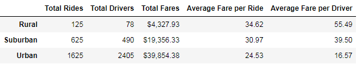
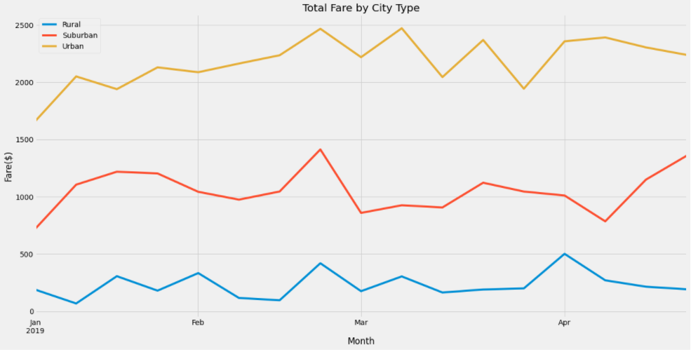

# PyBer_Analysis

## Overview of Project

The purpose of this project was to discover how fares, drivers and the average fares ranged within three different types of cities. This project gathered data from multiple cities that were separated by if they were suburban, rural, or urban. Then the amount of drivers, rides, and total fares were discovered and the averages of fares between rides and drivers was calculated. This will allow us to discover disparities and ways to address them.

## Results
  

The results are what I would expect across the three city types. Urban areas have a high concentration of drivers and rides leading to more fares. With the amount of rides and drivers the routes are probably shorter which means a lower fare per driver and ride. The opposite holds true for rural. We have a lower concentration of drivers and rides and I would guess longer routes leads to higher fares. 
   

Looking at the line chart shows something interesting. The total fares per month in the suburban areas fluctuates more so than the urban and rural areas. The very beginning of the year, almost the entire month of March and a little bit of April has dips below $1,000 total in fares. There are only two short term spikes close to $1,500 just before the start of March and at the end of April. The fares in the rural cities are consistently above $2,000 with two exceptions. The urban cities also show a consistency around $200 to $400 with the very beginning of April being the pea.
## Summary
One suggestion would be provide an incentive to encourage drivers to go to the suburban and rural areas to pick up rides. With the fares being higher in those areas that would allow the drivers to make more money and with more drivers this could encourage more people to use the service. A second suggestion would be to alter the fare rates for the suburban cities to bring some consistency to those areas. The final suggestion would be to re-visit the pricing entirely to make it more equitable according to the amount of drivers and rides. Other data would be needed such as time of day the rides occur, traffic patterns, distance travelled and others to make more worthwhile suggestions.
